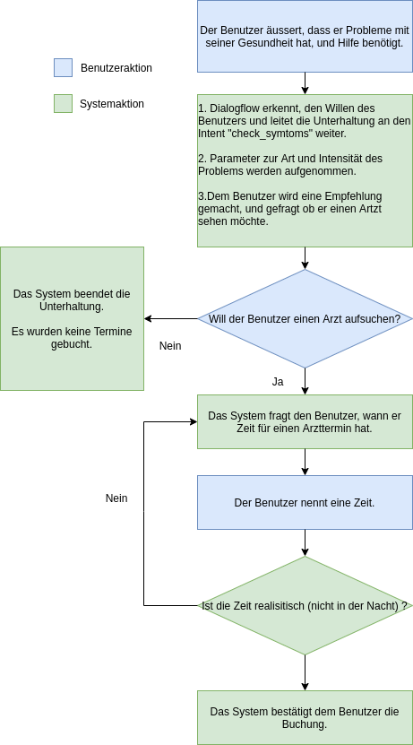

# Medical Assitant
A chatbot to detect if Corona symptoms are present.

# Contribution information
- Contributors: Adrian Locher & Jason Benz
- School: [OST - Eastern Switzerland University of Applied Sciences](https://www.ost.ch/)
- Module: AI Foundations (AIFo)
- Semester: Autmn 2021
- Advisor: Prof. Dr. Marco Lehmann
- Final grade: 5.6 / 6

# Overview
The goal of the project is to create a basic chatbot. The use of [Google Dialogflow](https://cloud.google.com/dialogflow/docs) is mandatory. The client for interaction with Google Dialogflow can be created in a language and on a system of the student's choice. For the client, we decided to create a console application using Java.

Details of the implementation and the final result can be found in the [report](./documentation/report.pdf). The rough flow is as follows (in German):
